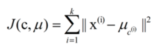
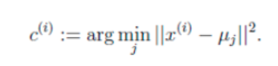
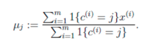

k-means算法实际上就是通过计算不同样本间的距离来判断他们的相近关系的, 相近的就会放到同一类别中去.
### 算法思想 
1. 首先我们需要选择一个k值, 也就是我们希望把数据分为多少类, 这里k的选择对结果的影响很大.
2. 然后我们需要选择最初的聚类点, 或者叫质心, 这里的选择一般都是随机选择的, 代码中的是在数据范围内随机选择, 另一种是随机选择数据中的点.这些点的选择会在很大程度上影响最终的结果. 这里有两种处理方法: 一种是多次去均值, 另一种是改进算法(bisecting K-means).
3. 接下来我们会把数据集中的所有点都计算下与这些质心的距离, 把它们分到离它们质心最近的那一类中去. 完成后我们则需要将每个簇算出平均值, 用这个点作为新的质心, 反复重复这两步, 直到收敛我们就得到了最终的结果.
### 公式
k-means算法的基础是最小误差平方和准则. 其代价函数是:

    
式子中, uc(i)表示第i个聚类的均值, 我们希望代价函数最小. 该代价函数无法用解析的方法最小化, 只能用迭代的方法.具体的求解算法如下:
1. 随机选取k个聚类质心点
2. 重复下面的过程直到收敛:
    1. 对于每一个样例i, 计算其应该属于的类:
    
    
    
    2. 对于每一个类j, 重新计算该类的质心:

    

    代码见 [kmeans.py](./kmeans.py)
